# Описание
Инструмент командной строки для визуализации графа зависимостей npm-пакета, 
включая транзитивные зависимости, с использованием Mermaid. 
Визуализатор выводит результат в графическом виде.

# Установка
1. Установите [Node.js](https://nodejs.org/) для вашей операционной системы для использования npm (Node Package Manager).
   
2. Установите Mermaid CLI глобально с помощью npm:
   ```bash
   npm install -g @mermaid-js/mermaid-cli
   ```
   
3. Убедитесь, что у вас установлен Python 3.x.

4. Установите необходимую библиотеку **requests**:
   ```bash
   pip install requests
   ```
5. Создайте виртуальное окружение (опционально):
   ```bash
   python3 -m venv venv
   source venv/bin/activate  # Для Linux/Mac
   venv\Scripts\activate     # Для Windows
   ```

Проект установлен.

# Конфигурационный файл

Для запуска визуализатора необходимо подготовить конфигурационный файл формата json.
Файл должен содержать данные в следующем формате:
```json
{
  "mermaid_path": "{mmdc_path}",
  "npm_registry_url": "https://registry.npmjs.org",
  "package_name": "{package_name}",
  "max_depth": 3
}
```

Где:
- **mmdc_path** -- Путь к программе для визуализации графов,
- **npm_registry_url** -- URL-адрес, по которому находится npm-регистратор, 
с которым можно работать для получения информации о пакетах
- **package_name** -- Имя анализируемого пакета,
- **max_depth** -- Максимальная глубина анализа зависимостей.


# Запуск визуализатора

С готовым конфигурационным файлом выполнить следующую команду
```bash
py [path]/visualizer.py [config]
```

Где:

- **path** -- Путь до директории с визуализатором,
- **config** -- Путь до конфигурационного файла.

# Выходные данные

Программа выдаёт два файла в директории проекта:

- **{package_name}_dependency_graph.mmd** -- Текстовая версия графа
- **{package_name}_dependency_graph.svg** -- Граф в формате svg

### Примеры выходных данных:

Пакет "axios":
<p align="left">
  
</p>

Пакет "react-dom":
<p align="left">
  
</p>

Пакет "express":
<p align="left">
  
</p>


# Тесты

Для всех методов были написаны тесты, в результате удалось добиться покрытия в 82%.
Перед запуском тестов, нужно перейти в директорию, где находится файл test_visualizer.py
Также нужно убедиться, что на устройстве установлена библиотека pytest и coverage

### Для запуска тестирования необходимо запустить следующий скрипт:

```shell
pytest -v
```

### Для генерации отчета о покрытии тестами необходимо выполнить команду:

```shell
coverage run --branch -m pytest test_functions.py
```

### Просмотр результатов покрытия:

```shell
coverage report
```

## Прохождение тестов:


## Процент покрытия:


