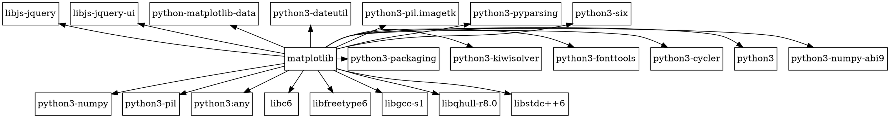

# Практическое занятие №2. Менеджеры пакетов

П.Н. Советов, РТУ МИРЭА

Разобраться, что представляет собой менеджер пакетов, как устроен пакет, как читать версии стандарта semver. Привести примеры программ, в которых имеется встроенный пакетный менеджер.

## Задача 1

Вывести служебную информацию о пакете matplotlib (Python). Разобрать основные элементы содержимого файла со служебной информацией из пакета. Как получить пакет без менеджера пакетов, прямо из репозитория?

Решение:
```bash
apt show python3-matplotlib
```


## Задача 2

Вывести служебную информацию о пакете express (JavaScript). Разобрать основные элементы содержимого файла со служебной информацией из пакета. Как получить пакет без менеджера пакетов, прямо из репозитория?

Решение:
```bash
apt show node-express
```


## Задача 3

Сформировать graphviz-код и получить изображения зависимостей matplotlib и express.

Решение:






```dot
digraph {

    node [shape="box", margin="0.05"];
    root [label="express"];
    a [label="node-accepts"];
    b [label="node-array-flatten"];
    c [label="node-body-parser"];
    d [label="node-content-disposition"];
    e [label="node-content-type"];
    f [label="node-cookie"];
    g [label="node-cookie-signature"];
    h [label="node-debug"];
    i [label="node-depd"];
    j [label="node-encodeurl"];
    k [label="node-escape-html"];
    l [label="node-etag"];
    m [label="node-finalhandler"];
    n [label="node-fresh"];
    o [label="node-merge-descriptors"];
    p [label="node-methods"];
    q [label="node-on-finished"];
    r [label="node-parseurl"];
    s [label="node-path-to-regexp"];
    t [label="node-proxy-addr"];
    u [label="node-qs"];
    v [label="node-range-parser"];
    w [label="node-safe-buffer"];
    x [label="node-send"];
    y [label="node-serve-static"];
    z [label="node-setprototypeof"];
    A [label="node-statuses"];
    B [label="node-type-is"];
    C [label="node-utils-merge"];
    D [label="node-vary"];
    E [label="nodejs:any"];
    
    
    root -> a;
    root -> b;
    root -> c;
    root -> d;
    root -> e;
    root -> f;
    root -> g;
    root -> h;
    root -> i;
    root -> j;
    root -> k;
    root -> l;
    root -> m;
    root -> n;
    root -> o;
    root -> p;
    root -> q;
    root -> r;
    root -> s;
    root -> t;
    root -> u;
    root -> v;
    root -> w;
    root -> x;
    root -> y;
    root -> z;
    root -> A;
    root -> B;
    root -> C;
    root -> D;
    root -> E;
    
    {rank=min; a b c d e f g h i j;}
    {rank=same; root m n o p q r s t;}
}
```

## Задача 4

Изучить основы программирования в ограничениях. Установить MiniZinc, разобраться с основами его синтаксиса и работы в IDE.

Решить на MiniZinc задачу о счастливых билетах. Добавить ограничение на то, что все цифры билета должны быть различными (подсказка: используйте all_different). Найти минимальное решение для суммы 3 цифр.

## Задача 5

Решить на MiniZinc задачу о зависимостях пакетов для рисунка, приведенного ниже.


## Задача 6

Решить на MiniZinc задачу о зависимостях пакетов для следующих данных:

```
root 1.0.0 зависит от foo ^1.0.0 и target ^2.0.0.
foo 1.1.0 зависит от left ^1.0.0 и right ^1.0.0.
foo 1.0.0 не имеет зависимостей.
left 1.0.0 зависит от shared >=1.0.0.
right 1.0.0 зависит от shared <2.0.0.
shared 2.0.0 не имеет зависимостей.
shared 1.0.0 зависит от target ^1.0.0.
target 2.0.0 и 1.0.0 не имеют зависимостей.
```

## Задача 7

Представить на MiniZinc задачу о зависимостях пакетов в общей форме, чтобы конкретный экземпляр задачи описывался только своим набором данных.
