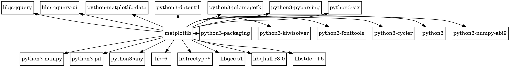

# Практическое занятие №2. Менеджеры пакетов

П.Н. Советов, РТУ МИРЭА

Разобраться, что представляет собой менеджер пакетов, как устроен пакет, как читать версии стандарта semver. Привести примеры программ, в которых имеется встроенный пакетный менеджер.

## Задача 1

Вывести служебную информацию о пакете matplotlib (Python). Разобрать основные элементы содержимого файла со служебной информацией из пакета. Как получить пакет без менеджера пакетов, прямо из репозитория?

Решение:
```bash
apt show python3-matplotlib
```


## Задача 2

Вывести служебную информацию о пакете express (JavaScript). Разобрать основные элементы содержимого файла со служебной информацией из пакета. Как получить пакет без менеджера пакетов, прямо из репозитория?

Решение:
```bash
apt show node-express
```


## Задача 3

Сформировать graphviz-код и получить изображения зависимостей matplotlib и express.

Решение:






```dot
digraph {

    node [shape="box", margin="0.05"];
    root [label="express"];
    a [label="node-accepts"];
    b [label="node-array-flatten"];
    c [label="node-body-parser"];
    d [label="node-content-disposition"];
    e [label="node-content-type"];
    f [label="node-cookie"];
    g [label="node-cookie-signature"];
    h [label="node-debug"];
    i [label="node-depd"];
    j [label="node-encodeurl"];
    k [label="node-escape-html"];
    l [label="node-etag"];
    m [label="node-finalhandler"];
    n [label="node-fresh"];
    o [label="node-merge-descriptors"];
    p [label="node-methods"];
    q [label="node-on-finished"];
    r [label="node-parseurl"];
    s [label="node-path-to-regexp"];
    t [label="node-proxy-addr"];
    u [label="node-qs"];
    v [label="node-range-parser"];
    w [label="node-safe-buffer"];
    x [label="node-send"];
    y [label="node-serve-static"];
    z [label="node-setprototypeof"];
    A [label="node-statuses"];
    B [label="node-type-is"];
    C [label="node-utils-merge"];
    D [label="node-vary"];
    E [label="nodejs:any"];
    
    
    root -> a;
    root -> b;
    root -> c;
    root -> d;
    root -> e;
    root -> f;
    root -> g;
    root -> h;
    root -> i;
    root -> j;
    root -> k;
    root -> l;
    root -> m;
    root -> n;
    root -> o;
    root -> p;
    root -> q;
    root -> r;
    root -> s;
    root -> t;
    root -> u;
    root -> v;
    root -> w;
    root -> x;
    root -> y;
    root -> z;
    root -> A;
    root -> B;
    root -> C;
    root -> D;
    root -> E;
    
    {rank=min; a b c d e f g h i j;}
    {rank=same; root m n o p q r s t;}
}
```

## Задача 4

Изучить основы программирования в ограничениях. Установить MiniZinc, разобраться с основами его синтаксиса и работы в IDE.

Решить на MiniZinc задачу о счастливых билетах. Добавить ограничение на то, что все цифры билета должны быть различными (подсказка: используйте all_different). Найти минимальное решение для суммы 3 цифр.

Решение:
```MiniZinc
include "alldifferent.mzn";

var 0..9: a;
var 0..9: b;
var 0..9: c;
var 0..9: d;
var 0..9: e;
var 0..9: f;

constraint a + b + c == d + e + f;

constraint alldifferent([a,b,c,d,e,f]);

solve minimize a + b + c;
```


## Задача 5

Решить на MiniZinc задачу о зависимостях пакетов для рисунка, приведенного ниже.


Решение: Я создал программу minizinc, которая решает любую задачу зависимостей пакетов (в общей форме), которая удовлетворяет задаче 7. Код представлен в решении задачи 7, здесь представлены только входные данные

Файл data.dzn
```minizinc
target_name = "root";
  
packages = [

  (name: "root", version: (1,0,0)), 
  
  (name: "menu", version: (1,0,0)),
  (name: "menu", version: (1,1,0)),
  (name: "menu", version: (1,2,0)),
  (name: "menu", version: (1,3,0)),
  (name: "menu", version: (1,4,0)),
  (name: "menu", version: (1,5,0)),
  
  (name: "icons", version: (1,0,0)),
  (name: "icons", version: (2,0,0)),
  
  (name: "dropdown", version: (1,8,0)),
  (name: "dropdown", version: (2,0,0)),
  (name: "dropdown", version: (2,1,0)),
  (name: "dropdown", version: (2,2,0)),
  (name: "dropdown", version: (2,3,0))
  
];

dependencies = [
  (package: (name: "root", version: (1,0,0)), require: (name: "menu", version: (1,0,0)), interval: "="),
  (package: (name: "root", version: (1,0,0)), require: (name: "menu", version: (1,5,0)), interval: "="),
  (package: (name: "root", version: (1,0,0)), require: (name: "icons", version: (1,0,0)), interval: "^"),
  
  (package: (name: "menu", version: (1,0,0)), require: (name: "dropdown", version: (1,8,0)), interval: "="),
  (package: (name: "menu", version: (1,1,0)), require: (name: "dropdown", version: (2,0,0)), interval: "="),
  (package: (name: "menu", version: (1,1,0)), require: (name: "dropdown", version: (2,3,0)), interval: "="),
  (package: (name: "menu", version: (1,2,0)), require: (name: "dropdown", version: (2,0,0)), interval: "="),
  (package: (name: "menu", version: (1,2,0)), require: (name: "dropdown", version: (2,3,0)), interval: "="),
  (package: (name: "menu", version: (1,3,0)), require: (name: "dropdown", version: (2,0,0)), interval: "="),
  (package: (name: "menu", version: (1,3,0)), require: (name: "dropdown", version: (2,3,0)), interval: "="),
  (package: (name: "menu", version: (1,4,0)), require: (name: "dropdown", version: (2,0,0)), interval: "="),
  (package: (name: "menu", version: (1,4,0)), require: (name: "dropdown", version: (2,3,0)), interval: "="),
  (package: (name: "menu", version: (1,5,0)), require: (name: "dropdown", version: (2,0,0)), interval: "="),
  (package: (name: "menu", version: (1,5,0)), require: (name: "dropdown", version: (2,3,0)), interval: "="),
  
  
  (package: (name: "dropdown", version: (2,0,0)), require: (name: "icons", version: (2,0,0)), interval: "~"),
  (package: (name: "dropdown", version: (2,1,0)), require: (name: "icons", version: (2,0,0)), interval: "="),
  (package: (name: "dropdown", version: (2,2,0)), require: (name: "icons", version: (2,0,0)), interval: "^"),
  (package: (name: "dropdown", version: (2,3,0)), require: (name: "icons", version: (2,0,0)), interval: ">=")
];
```


## Задача 6

Решить на MiniZinc задачу о зависимостях пакетов для следующих данных:

```
root 1.0.0 зависит от foo ^1.0.0 и target ^2.0.0.
foo 1.1.0 зависит от left ^1.0.0 и right ^1.0.0.
foo 1.0.0 не имеет зависимостей.
left 1.0.0 зависит от shared >=1.0.0.
right 1.0.0 зависит от shared <2.0.0.
shared 2.0.0 не имеет зависимостей.
shared 1.0.0 зависит от target ^1.0.0.
target 2.0.0 и 1.0.0 не имеют зависимостей.
```

Решение: Я создал программу minizinc, которая решает любую задачу зависимостей пакетов (в общей форме), которая удовлетворяет задаче 7. Код представлен в решении задачи 7, здесь представлены только входные данные

Файл data.dzn
```minizinc
target_name = "root";
  
packages = [
  (name: "root", version: (1,0,0)), 
  
  (name: "foo", version: (1,1,0)),
  (name: "foo", version: (1,0,0)),
  
  (name: "left", version: (1,0,0)),
  
  (name: "right", version: (1,0,0)),
  
  (name: "shared", version: (2,0,0)),
  (name: "shared", version: (1,0,0)),
  
  (name: "target", version: (2,0,0)),
  (name: "target", version: (1,0,0))
];

dependencies = [
  (package: (name: "root", version: (1,0,0)), require: (name: "foo", version: (1,0,0)), interval: "^"),
  (package: (name: "root", version: (1,0,0)), require: (name: "target", version: (2,0,0)), interval: "^"),
  
  (package: (name: "foo", version: (1,1,0)), require: (name: "left", version: (1,0,0)), interval: "^"),
  (package: (name: "foo", version: (1,1,0)), require: (name: "right", version: (1,0,0)), interval: "^"),
  
  (package: (name: "left", version: (1,0,0)), require: (name: "shared", version: (1,0,0)), interval: ">="),
  
  (package: (name: "right", version: (1,0,0)), require: (name: "shared", version: (2,0,0)), interval: "<"),
  
  (package: (name: "shared", version: (1,0,0)), require: (name: "target", version: (1,0,0)), interval: "^")
];
```


## Задача 7

Представить на MiniZinc задачу о зависимостях пакетов в общей форме, чтобы конкретный экземпляр задачи описывался только своим набором данных.

Решение:

```minizinc
type Version = tuple(int, int, int);
type Package = record(string: name, Version: version);
type Dependency = record(Package: package, Package: require, string: interval);

predicate major_e__minor_e__patch_e(Version:versionV, Version:versionP) = 
  versionV.1==versionP.1 /\ versionV.2==versionP.2 /\ versionV.3==versionV.3;

predicate major_e__minor_e__patch_b(Version:versionV, Version:versionP) = 
  versionV.1==versionP.1 /\ versionV.2==versionP.2 /\ versionV.3>versionV.3;
    
predicate major_e__minor_e__patch_l(Version:versionV, Version:versionP) = 
  versionV.1==versionP.1 /\ versionV.2==versionP.2 /\ versionV.3<versionV.3;
    
predicate major_e__minor_b(Version:versionV, Version:versionP) =
  versionV.1==versionP.1 /\ versionV.2>versionP.2;
  
predicate major_e__minor_l(Version:versionV, Version:versionP) = 
  versionV.1==versionP.1 /\ versionV.2<versionP.2;

predicate major_b(Version:versionV, Version:versionP) = 
  versionV.1>versionP.1;

predicate major_l(Version:versionV, Version:versionP) = 
  versionV.1<versionP.1;

array[_] of Package: packages;
array[_] of Dependency: dependencies;
string: target_name;

int: N = length(packages);
int: M = length(dependencies);

%%% Массив установленных пакетов (1 - установлен, 0 - не установлен)
array[1..N] of var 0..1: installed;

%%% Одноименный пакет должен быть установлен не более 1 версии
constraint forall(i in 1..N)(sum(j in 1..N where packages[i].name == packages[j].name)(installed[j]) <= 1);
  
%%% Целевой пакет должен быть установлен одной версии
constraint (sum(j in 1..N where target_name == packages[j].name)(installed[j]) == 1);

%%% Ограничение на зависимости
% Для всех установленных пакетов
constraint forall (p in 1..N where installed[p] == 1)  
(
  % Для всех зависимостей, которые нужно для пакета p
  forall(d in 1..M where dependencies[d].package == packages[p]) 
  (
    % Существует хотя бы одна другая зависимость с таким же пакетом и таким же именем требуемого пакета
    exists(ad in 1..M where dependencies[ad].require.name == dependencies[d].require.name /\ dependencies[ad].package == dependencies[d].package) 
    (
      % Такая, что для этой зависимости существует установленный пакет, у которого такое же имя и подходящая версия под интервал
      exists(dp in 1..N where packages[dp].name == dependencies[ad].require.name) 
      (
        installed[dp] == 1 /\
        (
          if dependencies[ad].interval = "^"
          then (    
            major_e__minor_e__patch_e(packages[dp].version, dependencies[ad].require.version) \/
            major_e__minor_e__patch_b(packages[dp].version, dependencies[ad].require.version) \/
            major_e__minor_b(packages[dp].version, dependencies[ad].require.version)
          )
          elseif dependencies[ad].interval = "~"
          then (    
            major_e__minor_e__patch_e(packages[dp].version, dependencies[ad].require.version) \/
            major_e__minor_e__patch_b(packages[dp].version, dependencies[ad].require.version)
          )
          elseif dependencies[ad].interval = ">="
          then (
            major_e__minor_e__patch_e(packages[dp].version, dependencies[ad].require.version) \/
            major_e__minor_e__patch_b(packages[dp].version, dependencies[ad].require.version) \/
            major_e__minor_b(packages[dp].version, dependencies[ad].require.version) \/
            major_b(packages[dp].version, dependencies[ad].require.version)
          )
          elseif dependencies[ad].interval = ">"
          then (
            major_e__minor_e__patch_b(packages[dp].version, dependencies[ad].require.version) \/
            major_e__minor_b(packages[dp].version, dependencies[ad].require.version) \/
            major_b(packages[dp].version, dependencies[ad].require.version)
          )
          elseif dependencies[ad].interval = "<="
          then (
            major_e__minor_e__patch_e(packages[dp].version, dependencies[ad].require.version) \/
            major_e__minor_e__patch_l(packages[dp].version, dependencies[ad].require.version) \/
            major_e__minor_l(packages[dp].version, dependencies[ad].require.version) \/
            major_l(packages[dp].version, dependencies[ad].require.version)
          )
          elseif dependencies[ad].interval = "<"
          then (
            major_e__minor_e__patch_l(packages[dp].version, dependencies[ad].require.version) \/
            major_e__minor_l(packages[dp].version, dependencies[ad].require.version) \/
            major_l(packages[dp].version, dependencies[ad].require.version)
          )
          else major_e__minor_e__patch_e(packages[dp].version, dependencies[ad].require.version)
          endif
        )
      )
    )
  )
);

solve minimize sum(i in 1..N)(installed[i]);

output["Целевой пакет: \(target_name)\n"];
output["\nИсходные зависимости:\n"];
output["\(dependencies[i])\n" | i in 1..M];
output["\nУстановленные пакеты (1 - установлен, 0 - не установлен):\n"];
output["\(installed[i]): \(packages[i])\n" | i in 1..N];
```

Входные данные:
```minizinc
% Пакет, который требуется установить
%
% target_name = <ИМЯ-ЦЕЛЕВОГО-ПАКЕТА>, где <ИМЯ-ЦЕЛЕВОГО-ПАКЕТА> - строчное наименование пакета
%
% Пример:
target_name = "root";


% Пакеты, доступные для установки
%
% Пакет записывается в виде:
% (name: <ИМЯ-ПАКЕТА>, version: <ВЕРСИЯ-ПАКЕТА>)
%
% <ИМЯ-ПАКЕТА> - строчное наименование пакета
%
% <ВЕРСИЯ-ПАКЕТА> записывается в виде (<a>,<b>,<c>), 
% где <a> - мажорная версия, <b> - минорная версия, <c> - патч-версия
%
% Пример:
packages = [
  (name: "root", version: (1,0,0)), 
  (name: "root", version: (1,1,0)),
  
  (name: "foo", version: (1,0,0)),
  (name: "foo", version: (1,2,3)),
  (name: "foo", version: (2,5,0))
];

% Зависимости, требуемые для установки пакета

% Зависимость записывается в виде:
% (package: <УСТАНАВЛИВАЕМЫЙ-ПАКЕТ>, require: <ТРЕБУЕМЫЙ-ПАКЕТ>, interval: <ИНТЕРВАЛ-ВЕРСИЙ>)
%
% <УСТАНАВЛИВАЕМЫЙ-ПАКЕТ> - Конкретный пакет, для которого требуется установка другого пакета. 
% Вид записи представлен выше
%
% <ТРЕБУЕМЫЙ-ПАКЕТ> - пакет, установка которого требуется. 
% Указывается требуемое имя, версия пакета используется для интервала
% Вид записи представлен выше
%
% <ИНТЕРВАЛ-ВЕРСИЙ> - строчное указание интервала, доступные интервалы:
% "^"; "~", ">=", ">", "<=", "<". При указании любой другой строки будет использован интервал "="
%
% Пример:
dependencies = [
  (package: (name: "root", version: (1,0,0)), require: (name: "foo", version: (1,0,0)), interval: "^"),
  (package: (name: "root", version: (1,0,0)), require: (name: "foo", version: (2,0,0)), interval: "~"),
  
  (package: (name: "root", version: (1,1,0)), require: (name: "foo", version: (3,3,3)), interval: "<=")
];
```

